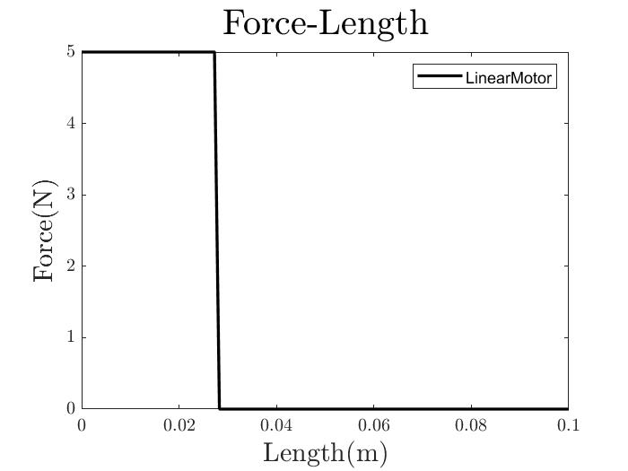
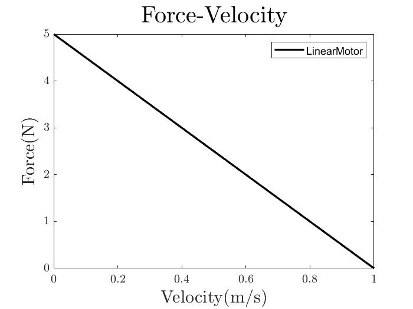
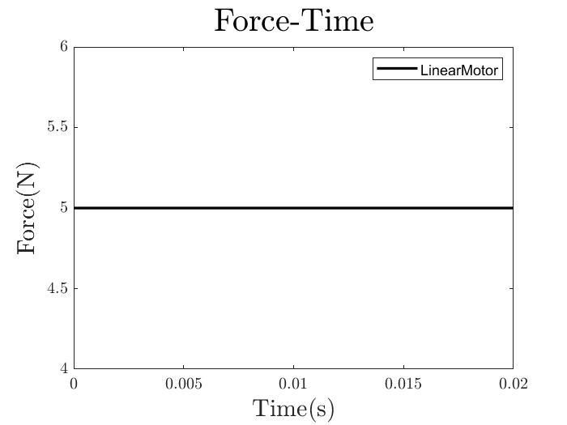
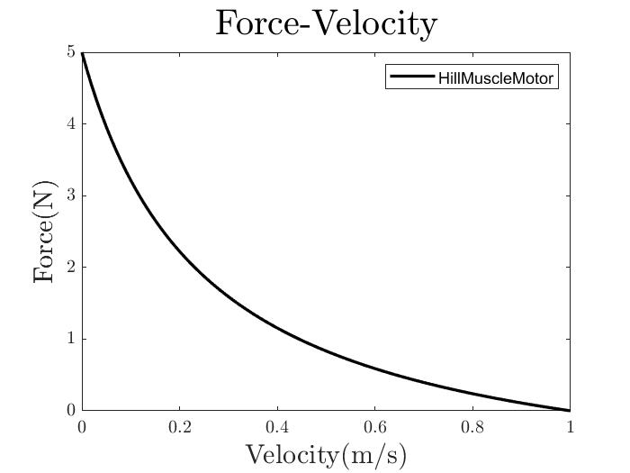
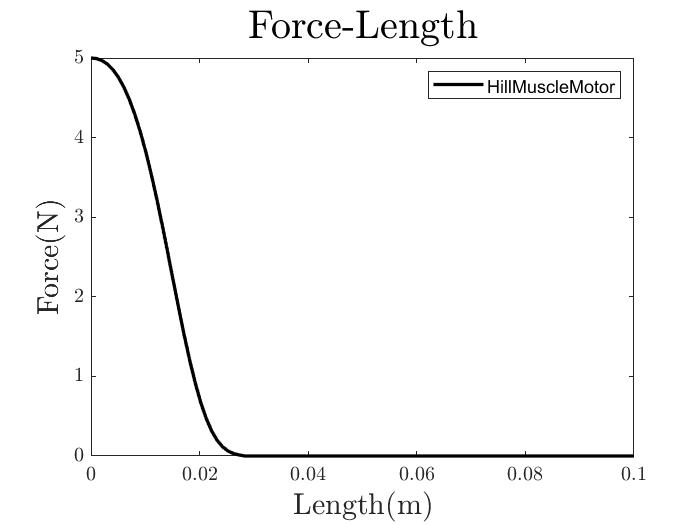
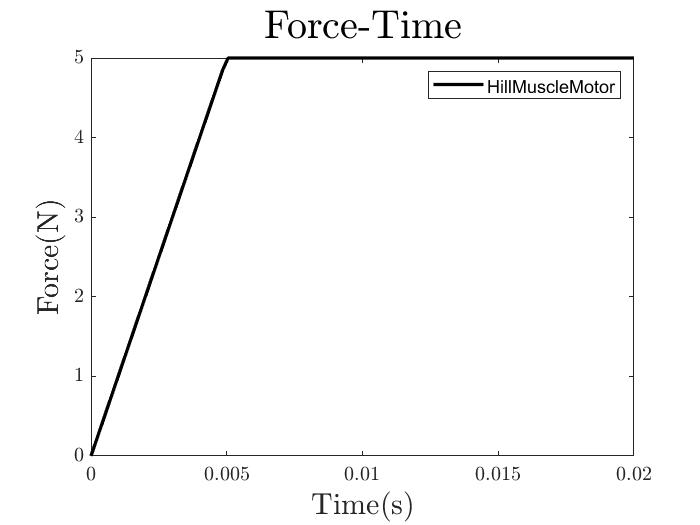
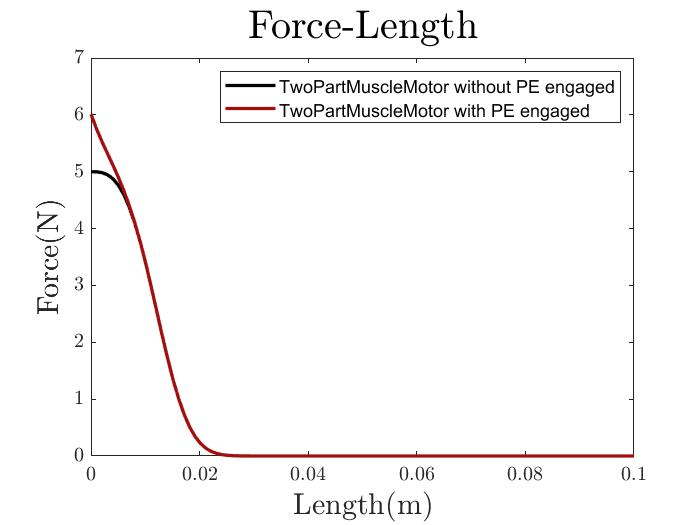
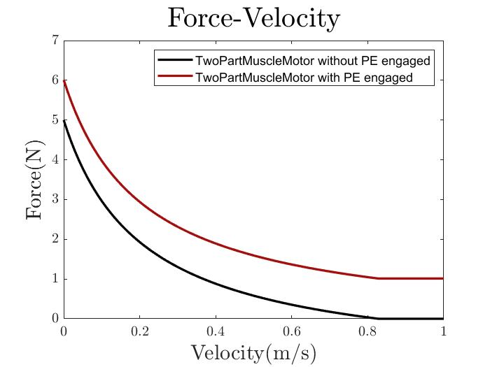
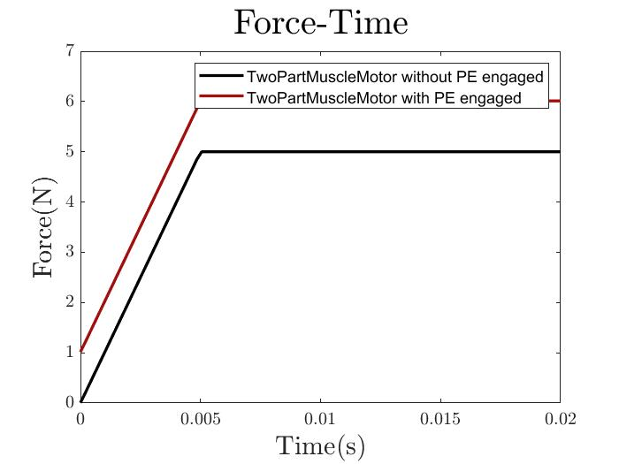

# Muscle Mechanics and Modeling Primer

### Basics
Muscle mechanics are intrinsically difficult to model because of the practical difficulties. It's hard to measure muscle properties and kinematics, without drastically altering the conditions they perform in and therefore altering their performance. Without these measurements, models can be difficult to verify. To get a sense of where the field of muscle mechanics stands, read [Nishikawa et al SICB 2018](https://drive.google.com/file/d/1J6hNHWgol3XgY8FOeU45y29ljOrWOW2b/view?usp=sharing), focusing on force-length relationships, titin, and stretch. You don’t need to know much about cross-bridge models, as we don’t focus on neuromuscular systems. 

In a lot of muscle mechanics literature, you see references to OpenSim, which is a useful modeling software for looking at large musculoskeletal systems,like humans. While I wouldn’t recommend going to the trouble of downloading it, unless you plan to construct a new musculoskeletal model or have a specific model to work with, its muscle modeling methods (Millard and Thelen) are widely accepted. Skim [Millard et al ASME 2013](https://drive.google.com/file/d/1y5CJJ-qYJhhKfPMGGYU025OqLAb6s4x4/view?usp=sharing) to see some ways people go about modeling muscles, though our methods are signifantly more simplified. Our more sophisticated muscle motors are based in the Hill Muscle model. Read [Thelen ASME 2013](https://drive.google.com/file/d/1P7f6-phYuhpiZ6_2U_tazHxfViYWgDnz/view?usp=sharing), and draw the force-length relationship graph, force-velocity relationship graph, and labeled muscle diagram from this paper.

### Within the LaMSA Model

Open the LaMSA model in MATLAB and pull up the GUI. You’ll see unlatching and loading motor tabs. As you can see below, the loading motor compresses the spring and the unlatching motor yanks the latch out of the way (or holds the latch in place until it’s ready to unlatch in the case of the deactivating motor).

If you generate some 1D and 2D plots, you’ll also notice that the LaMSA plot is contrasted with direct actuation. Direct actuation shows what would happen if the mass was propelled by the loading motor instead of the spring.

Let’s now look at each of the motors. Generate a few kinematics and 1D plots with each, look at their code, draw the muscle they represent (like the diagram from Thelen), and write a good circumstance to use them.  

   

   LinearMotor
   
   

The LinearMotor simply exerts a given Force over a given range then immediately drops off, resulting in only one force over the time the motor is active. It can be modeled as a single contractile element. 

 

   

   DeactivatingMotor
   
   

The DeativatingMotor extends instead of contracting, exerting force in the opposite direction of the others. This makes it useful as an unlatching motor, but not a loading motor. As it can't be used for direct actuation, the MatLab model can't generate Force-Length, Force-Velocity, and Force-Time curves for it. It exerts just enough force to keep the latch in place then removes it at the deactivation rate.

   

   HillMuscleMotor
   
   

The HillMuscleMotor incorporates a hill muscle model from [Rosario et al RSPB 2016](https://drive.google.com/file/d/1hQZRgUJSEeX45XuyvUjl70zC1H38Xo8d/view?usp=sharing) Read the paper and draw the muscle model, force-length, force-velocity, and force-activation curves that you see. Note suitability of this model to modeling elastic systems. Below, you can see the Force-Length, Force-Velocity, and Force-Time relationships generate by the MatLab model.

   

   TwoPartMuscleMotor
   
   

The TwoPartMuscleMotor incorporates a version of the hill muscle model with a contractile and parallel elastic element. It also uses different constants and equations to model motion, so it’s more flexible. Read the paper it’s based on, [Hauefle et al JEB 2014](https://drive.google.com/file/d/1FPZSl_6uO3dHY5OEQ8Jqka2fGD2D--AG/view?usp=sharing), and draw the muscle element diagram. Below, you can see that the Force-Length, Force-Velocity, and Force-Time curves with and without the parallel elastic element engaged have a difference in places of low displacement. Otherwise, this hill model behaves largely like that in HillMuscleMotor.

 

### Next Steps

TwoPartMuscleMotor is new and could be further fine tuned. Also, it's capable of eccentric contraction, which isn't currently being utilized. The large number of constants in the constructor, which shape the force-length and force-velocity relationship curves, could be fine-tuned to reflect other types of muscle.

Generally, the existing muscle models could all stand to be further verified, whether using an alternate muscle-modeling software or checked against experimental data. 

Also, it could be useful to set up a kinematics tab to model direct actuation as well instead of just LaMSA. This could be useful when trying to study muscle mechanics or in the development of new motors.

An issue I've found is a lack of literature on invertebrate muscles. There is an abundance of research on mammalian muscles, especially slow twitch, but Rosario's paper is the only one I've seen that directly focuses on non-mammalian muscles. Additional information on the differences between mammalian and non-mammalian muscle would be extremeley helpful, espeicially if it can be translated into shifting parameters on existing muscle models.

Check out the muscle mechanics folder in the posm Google Drive for information about making the TwoPartMuscleMotor, more papers, and Monroy's data.
